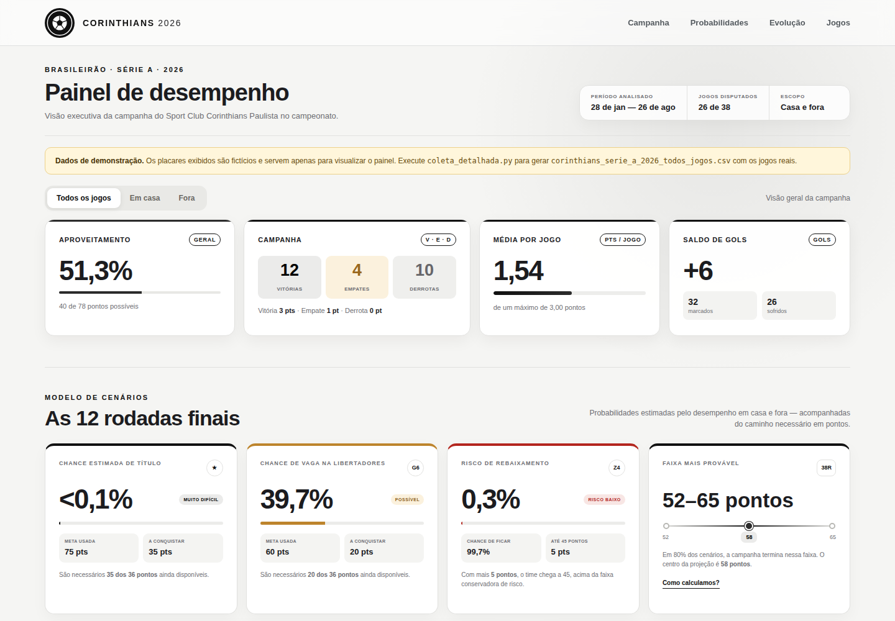

  

<h1 align="center">Dashboard Gerencial — Corinthians na Série A 2026</h1>

  Projeto de análise de dados esportivos que transforma os resultados da campanha do Sport Club Corinthians Paulista no Brasileirão em indicadores de desempenho, tendências e cenários probabilísticos.

  
  
  
  

> **Atenção:** a imagem acima e o arquivo `exemplo_demo_corinthians_serie_a_2026.csv` usam **placares fictícios**, apenas para demonstrar o painel. Os dados reais são gerados por `coleta_detalhada.py`. Enquanto o CSV real estiver vazio, o painel exibe um aviso de "Dados de demonstração".

## Sobre o projeto

Esta dashboard acompanha a campanha do Corinthians na Série A de 2026 sob uma perspectiva gerencial. O painel consolida os resultados jogo a jogo, compara o desempenho dentro e fora de casa (Neo Química Arena × visitante) e converte a campanha em informações úteis para tomada de decisão.

Além dos indicadores tradicionais, o projeto apresenta projeções para as rodadas finais e um modelo probabilístico que estima as chances de **título**, de **vaga na Libertadores (faixa do G6)** e de **rebaixamento (Z4)**.

## Panorama analisado

| Indicador | Resultado |
|---|---:|
| Jogos disputados | 28 |
| Pontos conquistados | 32 |
| Campanha | 8 vitórias, 8 empates e 12 derrotas |
| Aproveitamento | 38,1% |
| Média de pontos | 1,14 por jogo |
| Gols | 29 marcados e 32 sofridos |
| Saldo de gols | −3 |

Os dados representam o recorte disponível até 20 de setembro de 2026.

## Principais insights

- **Momento crítico:** o Corinthians vem de **6 derrotas consecutivas** (rodadas 23 a 28) e somou **0 de 15 pontos** nos últimos 5 jogos. A pontuação está parada em 32 desde a rodada 22.
- **Campanha oscilante:** o aproveitamento foi de **33,3%** nas rodadas 1–10, subiu para **60,0%** nas rodadas 11–20 (5V 3E 2D) e despencou para **16,7%** nas rodadas 21–28 (1V 1E 6D).
- **Mando de campo pouco decisivo:** o rendimento é de **40,0% em casa** e **35,9% fora**, uma diferença de apenas 4,1 pontos percentuais. O saldo é negativo nos dois cenários (−1 em casa e −2 fora), e **56,3% dos pontos** vieram como mandante.
- **Primeiro tempo como ponto fraco:** o time perde o 1º tempo por **13 a 20** (saldo −7) e vence o 2º por **16 a 12** (saldo +4). Em 6 jogos terminou melhor do que estava no intervalo e em 3 terminou pior, um ganho líquido de **+8 pontos** após o intervalo.
- **Defesa como ativo:** foram **10 jogos sem sofrer gol** em 28 (35,7%). O ataque, com 29 gols (1,04 por jogo), é o que limita a campanha.
- **Sequências:** a maior série invicta foi de **6 jogos** e a maior sequência de vitórias, de **3**.
- **Ritmo abaixo do esperado:** são **10 pontos abaixo** do ritmo de 50% de aproveitamento (42 pontos). Mantida a média de 1,14 ponto por jogo, a projeção é terminar com cerca de **43 pontos**.
- **Cenários:** o modelo concentra 80% dos resultados entre **38 e 49 pontos**, com **60,8% de chance de terminar com 44 pontos ou menos**, a faixa de risco de rebaixamento. A chance de vaga na Libertadores é inferior a 0,1%, e o título já é matematicamente inalcançável pela referência de 75 pontos.
- **Reta final exigente:** para sair da faixa de risco, o time precisa de **13 dos 30 pontos** restantes. Dos 10 jogos, **6 são fora de casa** (Internacional, Palmeiras, Vasco, São Paulo, Atlético Mineiro e Remo) e 4 na Neo Química Arena (Vitória, Mirassol, Botafogo e Grêmio).

## O que a dashboard entrega

- KPIs de pontos, aproveitamento, média por jogo e saldo de gols;
- distribuição de vitórias, empates e derrotas;
- evolução da pontuação rodada a rodada, comparada ao ritmo de 50%;
- comparação entre desempenho em casa e como visitante;
- gols marcados e sofridos no primeiro e no segundo tempo;
- rendimento por períodos da competição;
- sequência recente e indicadores de consistência;
- projeção de pontuação para as 38 rodadas;
- simulação de metas de pontos (40 a 80);
- cenários probabilísticos de título, Libertadores e rebaixamento;
- próximos adversários (espelhamento do primeiro turno);
- tabela completa com busca por adversário e filtros por mando de campo.

## Metodologia

### Pontuação e aproveitamento

- Vitória: 3 pontos; empate: 1 ponto; derrota: 0 ponto;
- aproveitamento: pontos conquistados ÷ pontos possíveis.

O painel considera somente partidas com `status` igual a `finished` e resultado `V`, `E` ou `D`.

### Modelo probabilístico

As probabilidades vêm de uma distribuição preditiva bayesiana (Dirichlet-multinomial com prior de Jeffreys), separando o desempenho como mandante e visitante. Os jogos restantes são identificados pelo espelhamento da tabela do primeiro turno.

Referências adotadas (constante `MODEL_LIMITS` em `app.js`):

- título: 75 pontos ou mais;
- Libertadores (faixa do G6): 60 pontos ou mais;
- rebaixamento: 44 pontos ou menos.

Essas faixas são referências analíticas, não cortes garantidos. O modelo não considera a campanha dos demais clubes, critérios de desempate, a força dos adversários nem a variação no número de vagas para a Libertadores.

## Tecnologias utilizadas

- **Python:** coleta e preparação dos dados;
- **Streamlit:** publicação da aplicação;
- **JavaScript:** cálculos, filtros, simulações e gráficos;
- **HTML e CSS:** estrutura, responsividade e identidade visual alvinegra;
- **CSV:** base consolidada.

## Estrutura do projeto

<pre><code>analise_corinthians/
├── app.js
├── coleta_detalhada.py
├── corinthians-logo.svg
├── corinthians_serie_a_2026_todos_jogos.csv      ← base real (gerada pela coleta)
├── dashboard-preview.png
├── exemplo_demo_corinthians_serie_a_2026.csv     ← dados fictícios de demonstração
├── index.html
├── requirements.txt
├── server.js
├── streamlit_app.py
└── styles.css
</code></pre>

## Executar localmente

### Streamlit

<pre><code>cd analise_corinthians
python -m pip install -r requirements.txt
python -m streamlit run streamlit_app.py
</code></pre>

Acesse <code>http://localhost:8501</code>.

### Versão HTML

<pre><code>node server.js
</code></pre>

Acesse <code>http://localhost:8000</code>.

## Atualização dos dados

O arquivo `coleta_detalhada.py` busca os jogos na API (incluindo placares do intervalo) e gera `corinthians_serie_a_2026_todos_jogos.csv`. Informe a chave da API e os identificadores da Série A e do Corinthians por variáveis de ambiente (PowerShell):

<pre><code>$env:FSAPI_KEY="SUA_CHAVE"
$env:SERIE_A_ID="lg_XXXXXXX"        # ID da Série A na API
$env:CORINTHIANS_ID="tm_XXXXXXX"    # ID do Corinthians na API
python coleta_detalhada.py
</code></pre>

Os IDs precisam ser consultados na documentação ou no painel da API. A chave não deve ser gravada no código nem enviada ao GitHub.

   ## Escudo

   O escudo do Sport Club Corinthians Paulista é marca registrada do clube e é usado aqui apenas para identificação, em projeto pessoal e sem fins comerciais.

---

Desenvolvido por [Edson Sena](https://github.com/edsonsena15-lab).
